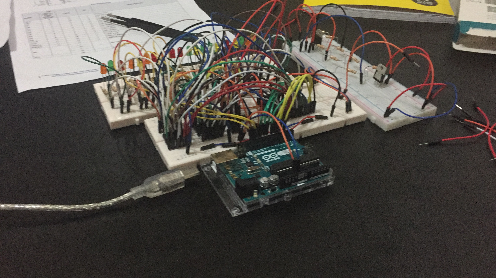
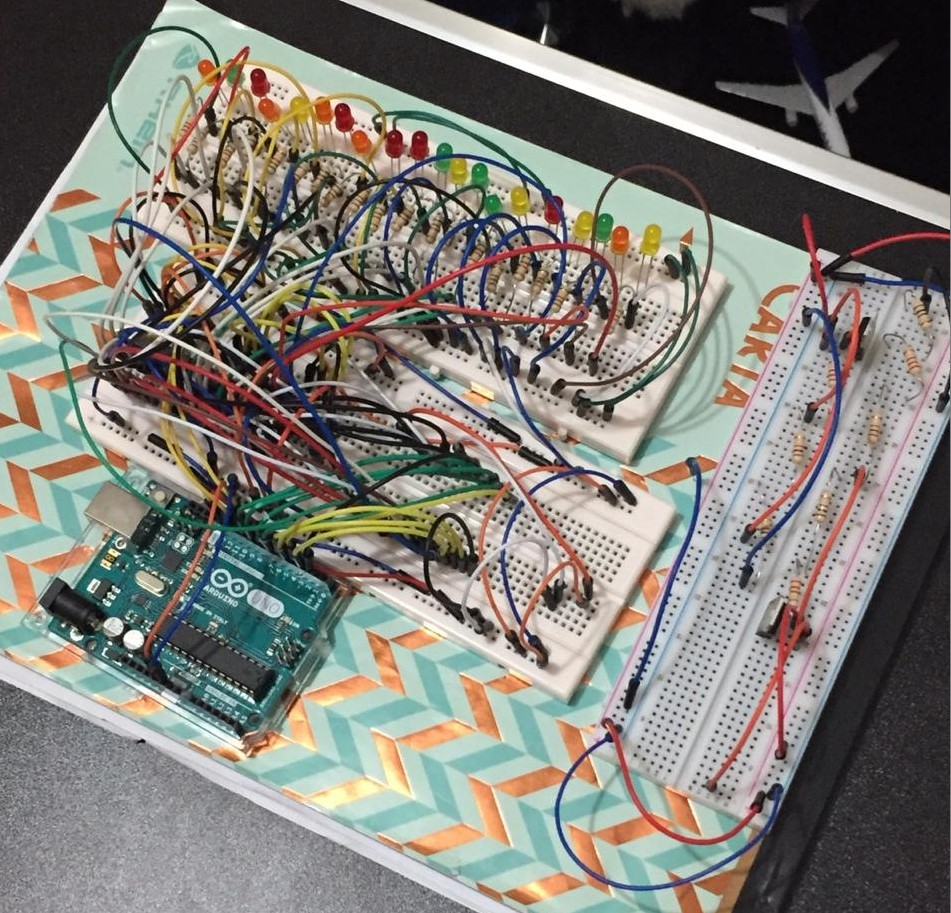

# Eprom Programmer
The idea is develop a programmer for EPROM m27c801 used tipically in snes reproduction carts with
an arduino and other simple components.

# Materials
1. 2 x LM317
2. 19V power supply (computer power supply)
3. 3 x 74hc595
4. Resistors (3 x 220&#8486;, 3 x 1K&#8486;, 1 x 100&#8486;, 1x10&#8486;)
5. Arduino UNO
6. M27c801 EPROM

# Schematic

 In my mount, i also add some leds to the adresses lines of EPROM for debugging purposes.

# How to use it
Mount the circuit for read or program mode. Then upload the corresponding arduino script and run the python script. The route for files in pythons scripts have to be changed manually.

The reason i did it in python is because the arduino has size limitations, so a 1MB binary file cannot be upload directly. The time to complete a reading or writing file is about 10 ~ 20 minutes.

# Example

Some pictures with the circuit mounted in a protoboard.

